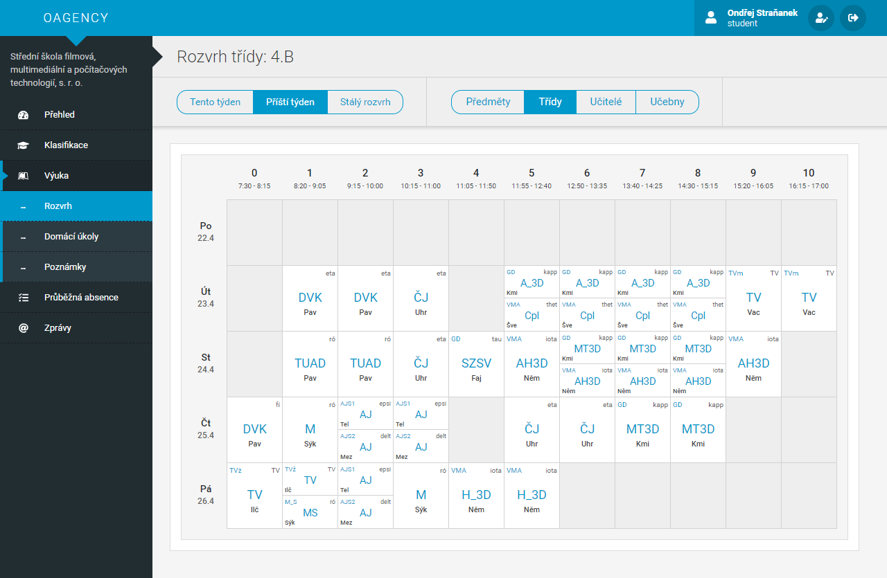
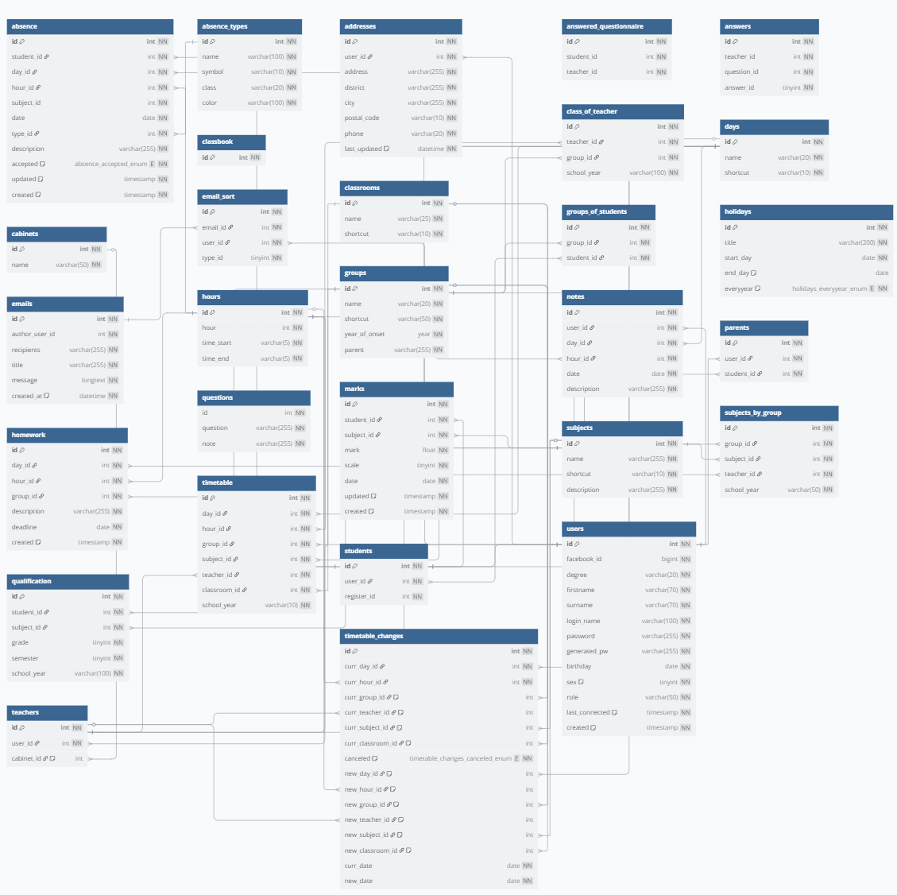

# School agenda

<b>The project was done between late 2018 to mid-2019.</b>

_"The goal of the graduation thesis was to create a comprehensive web system for managing the study agenda for the school."_

I was intrigued by a tool we utilized during my schooling. This sparked my curiosity about the level of complexity involved in its development. Especially the database design and then the most difficult work regarding the complexity of the schedule development.

Implementation of functionality for students, teachers, and administrators
* schedules
* classification
* absence
* classbook
* homework and notes
* manage user data
* and more...

<b>Tech stack</b>: PHP 7, Nette, MySQL, HTML, CSS (Sass), JS

_Screenshot of the schedule from the web app_

As is evident from the sample picture, the timetable outlines the schedule for class "4.B" for the upcoming week, notably showing Monday as unoccupied, potentially due to a holiday or the director's day off. Nonetheless, the functionality extends beyond this. As previously mentioned, the platform allows for the inclusion of homework assignments and notes for each specific lesson. Upon clicking on a lesson, users can access detailed descriptions, where students or teachers can input personal notes, while teachers typically append relevant tasks to the lesson. Furthermore, there is the flexibility to adjust or swap schedules based on various constraints, such as classroom availability.

_Screenshot of generated database diagram_

Finally, concerning the [database structure](structure.sql), while it served its purpose at the time, there are various potential enhancements to be considered. For instance, incorporating school holidays via a public API, storing and caching retrieved data would be more efficient than manually inputting these dates into the database.